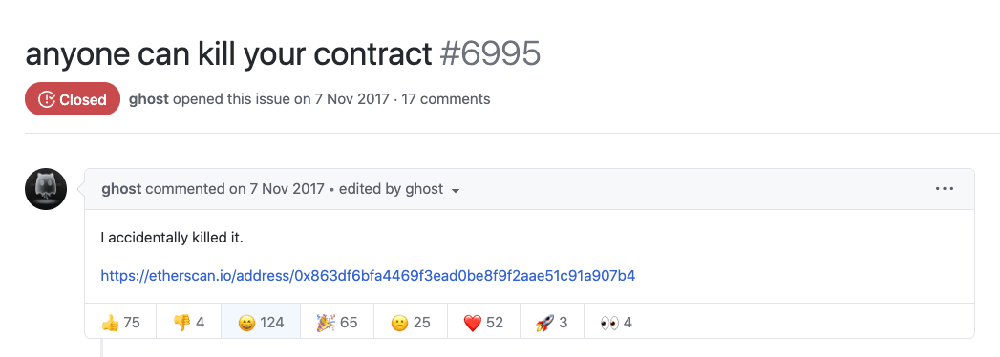

# Cómo convertirse en desarrollador de DeFi

Una guía de entrada sobre cómo puede mejorar sus habilidades para convertirse en desarrollador en el espacio DeFi

## Cuerpo de conocimientos # 1

**Entiende Bitcoin**. Antes de hacer cualquier otra cosa, obtenga un conocimiento básico sobre cómo funciona el primer Blockchain y los conceptos fundamentales. Si omite este paso, tendrá muchos agujeros en blanco en su comprensión, especialmente a medida que profundice en las aplicaciones DeFi y necesite garantizar las limitaciones y los riesgos de seguridad.

Algunos buenos marcadores para poner a prueba sus conocimientos serían si puede comprender los siguientes conceptos y podría volver a explicarlos:

1. Su billetera no es algo que "tiene", sino más bien una **clave privada/frase inicial** que le autoriza a realizar transacciones en la red Bitcoin. Si cree que una billetera es algo que está almacenado dentro de su dispositivo, debe regresar y revisar su comprensión.
1. ¿Qué es una transacción y qué hace que una sea válida frente a una inválida? **Nonces** y **UTXOs** (entradas y salidas) son conceptos clave para entender aquí.
1. ¿Qué es un **bloque** y cómo se construyen los bloques y luego se extraen para que sean válidos en la red? ¿Cómo evitan los mineros extraer las mismas transacciones?
1. ¿Cómo aseguran los incentivos de la red Bitcoin que alguien no pueda volver a escribir el historial o hacer trampas? Entender que 'piratear' la red de Bitcoin no solo es inviable sino contraproducente, ya que el acto de hacerlo destruiría el precio de BTC en sí.
1. ¿Qué son las bifurcaciones duras y las bifurcaciones blandas? Comprender **Segwit2x** y por qué fue controvertido es un buen curso intensivo.

Aquí se incluyen mis dos recursos para responder a las preguntas anteriores:

> - [Bitcoin Whitepaper](https://bitcoin.org/bitcoin.pdf)
>
> - [Comprensión del consenso](https://www.youtube.com/watch?v=bBC-nXj3Ng4)

---

## Cuerpo de conocimientos # 2

Ahora que está bien versado sobre cómo funciona una cadena de bloques de Prueba de trabajo (PoW), el modelo UTXO y por qué Bitcoin es revolucionario en su pensamiento: el siguiente paso es comprender qué hace que Ethereum sea especial y qué ventajas tiene una cadena de bloques basada en cuentas sobre una UTXO. Ethereum nació de la frustración de hacer cosas más avanzadas con el concepto de una cadena de bloques que Bitcoin no agregaría a su código base.

La clave que me gusta para ayudar a la gente a entender Ethereum es que es fundamentalmente una **máquina de estado**. Cada transacción es una **solicitud** para actualizar el **estado global** de esta meta-máquina (que en realidad está impulsada por miles de máquinas físicas).

Cuando se comprende y se pone al día con Ethereum, la lista de cosas que hay que entender se hace un poco más grande, pero es igualmente crucial de entender, ya que esta es la base del desarrollo moderno de la cadena de bloques:

1. Comprender cómo funcionan las cuentas en Ethereum y la diferencia entre un EOA y un contrato. La mayoría de la gente piensa que un smart contract es un "contrato de papel digital" que puede ejecutar transacciones automáticamente.
1. Tener un conocimiento firme de la máquina virtual Ethereum, el papel de Ether y cómo funciona la memoria/almacenamiento. No se preocupe si le asustan algunos de los conceptos superprofundos de la informática. Tómate tu tiempo y sigue leyendo hasta que sientas que tienes una comprensión básica de lo que se dice. **Aquí está bien dejar algunos detalles como abstracciones.**
1. Cómo se construyen y difunden las transacciones de Ethereum. La parte más difícil aquí es probablemente el papel entre **el costo del gas, el límite del gas y el precio del gas**. Esto es algo que confunde a los usuarios de la red Ethereum y también le tomará tiempo para entenderlo.
1. Tener una idea de cómo se ve Solidity y comprender el flujo de Solidity -> ABIs -> Bytecode. Asegúrese de mirar detenidamente los ABI, ya que son sus mejores amigos cuando trabaja con smart contracts.
1. Comprender las diferencias clave entre cómo funciona el envío de un token y cómo funciona el envío de Ether a otra cuenta. El matiz aquí es comprender que los tokens son en realidad solo saldos en un contrato, mientras que Ether es un ciudadano monetario de primera clase en la propia red.
1. Profundizar en cómo **funcionan las transacciones, los registros, los eventos y los filtros**. Esto es especialmente importante si desea crear una aplicación que lea datos fuera de la cadena.
1. Conocer cuáles son las limitaciones de los nodos completos, nodos ligeros y nodos de archivo + cómo conectarse a ellos a través de Infura + Ether.js/Web3.js. Si está creando una dApp, esta será una de las primeras cosas en las que se involucrará.

   **Consejo adicional:** aprenda cómo Metamask inyecta Web3.js en su aplicación. Es feo pero funciona.

1. Por último, pero no menos importante, es probable que desee leer algunos artículos sobre la seguridad de los smart contracts. Le mostrará algunos ejemplos de por qué escribir contratos inteligentes es más difícil que cualquier cosa que haya hecho antes, dado que son en esencia instrumentos financieros.

   **Palabras clave:** DAO Reentrancy Attack, Parity Multisig Exploit 2016.

   > 
   >
   > ##### Un desarrollador anónimo autodestruyó un contrato que contenía miles de millones de dólares. Ese dinero ahora se ha ido para siempre.

Como siempre, la mejor manera de aprender sobre Ethereum es realmente crear una aplicación con él. La creación de una sola dApp desde el principio hasta el final le ayudará.

> - [Una historia de la red Ethereum](https://www.reddit.com/r/ethereum/comments/7jj1so/rethereum_i_wrote_this_to_explain_ethereum_in/)
> - [Ethereum Beige Paper](https://github.com/chronaeon/beigepaper/blob/master/beigepaper.pdf) (una reescritura simplificada del papel amarillo)
> - [Una guía extremadamente detallada sobre el funcionamiento interno de Ethereum](https://www.preethikasireddy.com/post/how-does-ethereum-work-anyway)
> - [Aprendiendo a escribir Solidity](https://cryptozombies.io/)
> - Cree sus propias aplicaciones descentralizadas (dApps):
> - [The Ultimate Ethereum Dapp Tutorial (Cómo construir una aplicación descentralizada de pila completa paso a paso)](https://www.dappuniversity.com/articles/the-ultimate-ethereum-dapp-tutorial)
> - [Construyendo un dapp](https://docs.openzeppelin.com/learn/building-a-dapp)
> - [Cómo obtener y actualizar datos de Ethereum con React y SWR](https://consensys.net/blog/developers/how-to-fetch-and-update-data-from-ethereum-with-react-and-swr/)

La prueba definitiva para determinar si pasó esta etapa es que puede escribir un contrato básico de Solidity, crear un front-end simple (React), puede leer datos en cadena y volver a escribir datos en cadena. **¡Puntos de bonificación si puede leer algunos registros de eventos y mostrarlos en su interfaz!**

---

## Cuerpo de conocimientos # 3

Bien, ahora que está completamente equipado con cómo funcionan las cosas de Ethereum, la siguiente parte de su educación para aprender sobre DeFi es comprender cómo funcionan las finanzas y sus pilares básicos. Si eres un desarrollador experimentado que logró analizar lo anterior, probablemente te resulte difícil lo siguiente, ya que está fuera de tu dominio natural.

La razón por la que necesita conocer y comprender estos conceptos en el dorso de la palma de su mano cuando se convierte en un desarrollador de DeFi es porque **es literalmente un ingeniero financiero**. Si no comprende la cosa subyacente para la que es desarrollador, es casi seguro que perderá dinero.. No solo creará errores de seguridad, sino que también probablemente tendrá una comprensión sesgada de cómo funciona DeFi y qué productos quieren/necesitan los usuarios.

De acuerdo, basta de advertencias, intervengamos. Como ingeniero financiero, debe comprender y poder volver a explicar los siguientes términos si su madre le preguntó sobre ellos:

1. **Liquidez**. ¿Qué es y por qué importa?
1. **Tasas de interés fijas/variables**. ¿Cuáles son las ventajas y desventajas de ellos en el mundo financiero tradicional?
1. **Deuda**. ¿Qué formas de deuda existen y por qué las utilizan diferentes personas? La deuda de tarjetas de crédito es una forma de la que ha oído hablar, pero comprende por qué las empresas aceptan deudas por valor de miles de millones incluso cuando tienen mucho dinero en efectivo.
1. **Apalancamiento**. ¿Qué es, por qué la gente lo usa y cuáles son los peligros? Comprender la mecánica de lo que sucede cuando usa más dinero del que tiene es literalmente el 50% de DeFi.
1. **Negociación con margen**. ¿Qué es, por qué la gente lo usa y cuáles son los lugares populares para el comercio de margen en criptomonedas?
1. **Libros de ordenes**. Qué son, cómo funcionan, qué son depth/volume/bids/asks/limit orders, etc. Hay mucho que revisar aquí. Lo mejor es experimentar el comercio con dinero real.
1. **Opciones**. Si puede comprenderlos con facilidad, probablemente tenga conocimientos financieros suficientes para comprender todo lo anterior y pueda seguir adelante. Si no entiende las opciones, puede volver a visitarlas más tarde, pero no las deje fuera, ya que son un área emergente en DeFi.

No vincularé recursos para comprender los términos anteriores, ya que ya hay muchos, pero si realmente desea comprender más sobre las finanzas, le recomiendo lo siguiente:

> - [Una introducción sobre por qué necesitamos financiación y por qué ayuda al mundo](https://www.goodreads.com/book/show/30971680-the-wisdom-of-finance)
> - Ver "The Big Short" (2015). En serio.

---

## Cuerpo de conocimientos # 4

Muy bien, futuro desarrollador de DeFi inteligente y comprometido, felicidades por llegar tan lejos. No, en serio, estás tan cerca de alcanzar la luz al final del túnel. La etapa final de su educación consiste en aprender cómo funcionan las aplicaciones DeFi existentes mediante:

1. Leer los documentos técnicos o las publicaciones de blogs sobre su funcionamiento interno y lo que se proponen lograr.
1. Utilizándolos. **No en serio, uselos.**
1. Verificando su código en Github para entender qué está pasando debajo del capó.

Si desea omitir cualquiera de los tres, **no omita el número 2 no importa lo que haga.** Hasta que no use las aplicaciones DeFi, nunca podrá desarrollar para ellas. Lo mejor que puede hacer aquí es comprar $1,000 en ETH y tratarlo como dinero de matrícula que probablemente perderá. Entonces, ¿cuál es la lista de aplicaciones que dices? Aquí hay una lista de tareas que debe realizar.

### 1. Opere con una AMM

[PROTOCOLO UNISWAP](https://uniswap.org), [Código en Github](https://github.com/Uniswap/v2-core)

1. Cómo funcionan las aprobaciones de tokens
1. [Cómo funcionan los grupos de liquidez](https://www.youtube.com/watch?v=Ui1TBPdnEJU)
1. ¿Qué es el front-running y los riesgos?
1. Establecer el precio correcto del gas

### 2. Conviértete en un proveedor de liquidez

[PROTOCOLO UNISWAP](https://uniswap.org), [Código en Github](https://github.com/Uniswap/v2-core)

1. Qué significa ser un proveedor de liquidez y las compensaciones
1. [Comprenda qué es la pérdida impermanente](https://www.youtube.com/watch?v=41WVTwmSPng)
1. Aprenda cómo proporcionar liquidez puede generar un rendimiento pasivo

### 3. Abre una bóveda de MakerDAO

[Oasis](https://oasis.app/borrow), [Código en Github](https://github.com/makerdao/dss)

1. ¿Por qué DAI como moneda estable es única/diferente a cualquier otra cosa?
1. La motivación para que alguien acuñe DAI con sus criptoactivos
1. Los riesgos de usar una plataforma como MakerDAO desde el punto de vista del apalancamiento financiero
1. Comprender qué son las liquidaciones y cómo funcionan.

### 4. Pedir prestado USDC a través del compuesto

[Compound](https://compound.finance), [Código en Github](https://github.com/compound-finance/compound-protocol)

1. Comprenda que cuando presta a Compound obtiene "cTokens"
1. Aprender cómo funcionan las tasas de interés y cómo se acumulan los intereses en todos los saldos sin actualizar a cada usuario individualmente.
1. Comprender cuál es el factor de garantía y los riesgos asociados
1. Aprendiendo las diferencias entre Compound y MakerDAO

Si logra superar todo lo anterior con una competencia decente, ¡felicitaciones! Literalmente, ahora está listo para comenzar a desarrollar sus propias aplicaciones DeFi. Si necesita ayuda con cualquiera de los temas anteriores: vea los videos de [DeFi Weekly](https://www.youtube.com/c/DeFiWeekly)

---

## Desarrollando en DeFi

Como declaración general, todas las cosas básicas de TradFi (finanzas tradicionales) se han transferido a DeFi. La siguiente etapa en DeFi será cosas nuevas e involucrará una combinación de:

- Nuevos instrumentos financieros novedosos que no existen (fusionando primitivos)
- La integración de activos más novedosos con diferentes características (activos de deterioro temporal)
- Descubrir cómo mapear DeFi a NFT
- Desarrollo en nuevas cadenas emergentes (Ethereum es donde ocurre toda la actividad de DeFi, pero las oportunidades en otras cadenas de bloques son un territorio desconocido)
- Creación de interfaces para ayudar a comprender la compleja actividad de los datos en cadena.

Además, probablemente desee tomarse un tiempo para comprender todas las vulnerabilidades de DeFi recientes que ocurrieron en 2020 + 2021. Palabras clave: **ataques de préstamos flash y reentrada de tokens** son sus mejores amigos aquí.

Los mercados monetarios, los intercambios y la gestión de activos son espacios altamente competitivos a los que probablemente no debería acudir a menos que tenga una nueva perspectiva sobre cómo mejorarlos. Si va a ingresar a la arena DeFi, tiene algunas opciones presentadas:

1. **Únase a una empresa existente de DeFi** a tiempo completo que pueda mostrarle los entresijos y aprender en el trabajo. Podría decirse que es de menor riesgo y perfecto para aprender a manejar.
1. **Lance su propia empresa DeFi.** Esto puede ser excelente para subir de nivel sus habilidades técnicas muy rápidamente, aunque navegar por la estructura del mercado será un desafío y causará problemas si desea convertirlo en una empresa.
1. **Piensa en una idea y sigue hackeándola** con la expectativa de que tomará muchos meses, tal vez hasta un año, para que valga la pena. ¡Algunos de los proyectos más importantes en el espacio comenzaron de esta manera! Hay muchos hackatones de ETH Global que debería consultar aquí.
1. **Conviértete en colaborador** en una comunidad y ayuda con lo que necesiten. Dado que las criptomonedas tienen que ver con la comunidad, si puede ofrecer voluntariamente sus habilidades de desarrollador, habrá todo tipo de arreglos en los que puede participar. El comparable más fácil es ser un contractor en el mundo real.